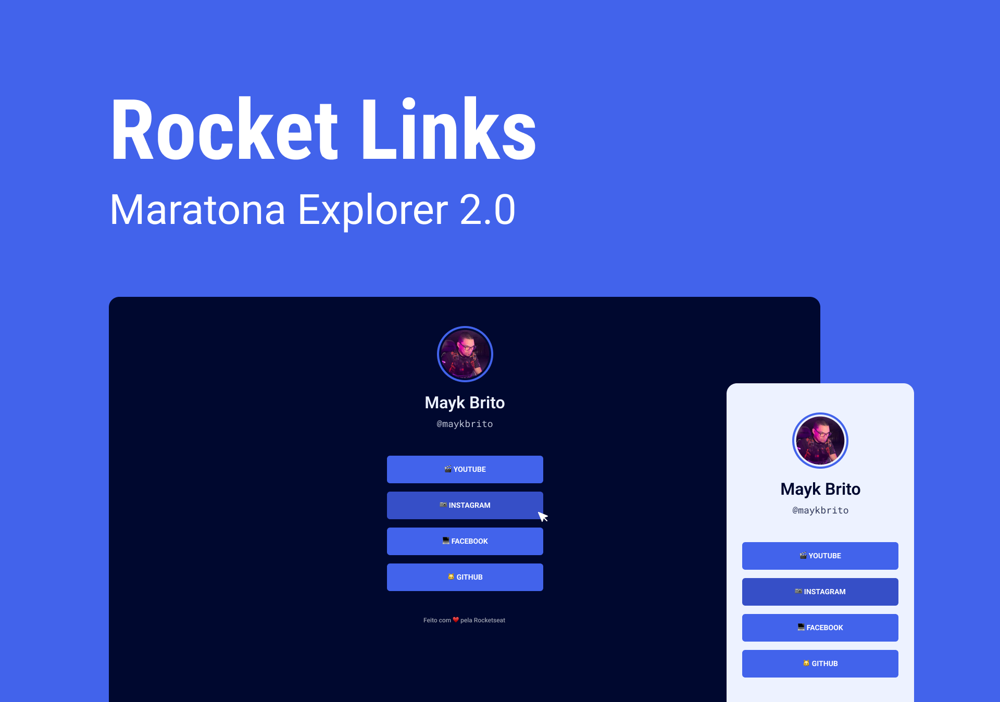

<h1 align="center">
  Rocket Links - Maratona Explorer 2.0
</h1>

  
  
  

<h1 align="center">
  
</h1>

 

## 💻 Projeto

Projeto de uma plataforma de links desenvolvida durante a Maratona Explorer 2.0 da [Rocketseat](https://rocketseat.com.br)

## 🧪 Tecnologias

Esse projeto foi desenvolvido com as seguintes tecnologias

- HTML
- CSS

## 🚀 Como executar

O app estará disponível no seu navegando acessando o endereço [https://pduartesilva2005.github.io/maratona-explorer-02/](https://pduartesilva2005.github.io/maratona-explorer-02/)

---

Feito com 💜 by Pedro Duarte 👋🏻
